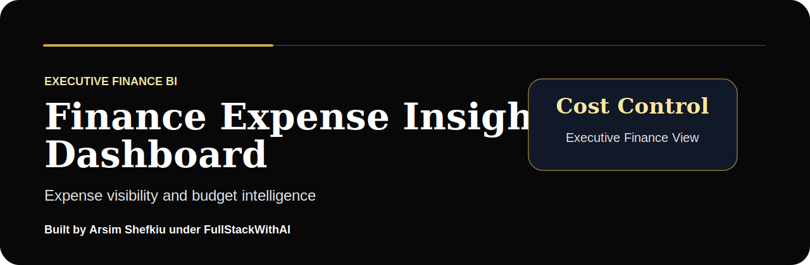

# Finance Expense Insights Dashboard

> Executive finance BI dashboard for expense visibility, budget variance, department spending, cash discipline, and cost-control intelligence.

Built by **Arsim Shefkiu** under **FullStackWithAI**.

[www.designhubmk.com](https://www.designhubmk.com) · arsim@designhubmk.com · [GitHub: fullstackwithai](https://github.com/fullstackwithai)

---

## Executive Finance Theme

> **Expenses to visibility. Budgets to control. Finance data to executive action.**

This repository is presented as a premium finance analytics dashboard for tracking expenses, budget variance, department-level spending, cost centers, and financial discipline.

| Theme Layer | Direction |
|---|---|
| **Design Identity** | Black, charcoal, gold, and executive finance accents |
| **Product Feel** | CFO-style expense command center / budget intelligence dashboard |
| **Audience** | Finance teams, founders, analysts, operations leaders, BI hiring managers |
| **Core Message** | Expense data + budget variance + department insight + cost control |

---

## Finance KPI Layer

| KPI | Purpose |
|---|---|
| **Total Expenses** | Tracks overall cost activity |
| **Budget Variance** | Shows where actual spend exceeds or beats plan |
| **Top Cost Center** | Identifies the biggest spending area |
| **Monthly Burn** | Measures operating cost speed |
| **Savings Opportunity** | Highlights areas for cost optimization |

---

## Business Questions

| Question | Why It Matters |
|---|---|
| **Which departments are over budget?** | Helps leadership control spending |
| **Where are costs increasing fastest?** | Identifies financial risk early |
| **Which vendors drive the most spend?** | Supports procurement negotiation |
| **Where can savings be found?** | Turns expense data into action |

---

## What This Project Demonstrates

| Capability | Evidence in This Repo |
|---|---|
| **Finance Analytics** | Budget, expense, variance, and cost-center analysis |
| **Executive BI Thinking** | CFO-ready KPI structure and decision-support framing |
| **Data Storytelling** | Turns spending data into cost-control recommendations |
| **Dashboard Strategy** | Focused finance reporting for leadership visibility |
| **Portfolio Positioning** | Strong DA/BI project for finance, operations, and analyst roles |

---

## Suggested Project Architecture

```text
finance-expense-insights-dashboard/
├── assets/
│   └── readme-hero.svg
├── data/
│   └── expenses-sample.csv
├── sql/
│   └── expense-variance-analysis.sql
├── dashboard/
│   ├── index.html
│   ├── styles.css
│   └── app.js
├── insights/
│   └── finance-summary.md
└── README.md
```

---

## Creator & Brand

### Built by **Arsim Shefkiu** under **FullStackWithAI**

> **Executive finance theme focused on budget visibility, expense control, variance analysis, and decision-ready reporting.**

| Creator Focus | Brand Positioning |
|---|---|
| I build finance dashboards that turn cost activity into clearer budget and operating decisions. | **FullStackWithAI** represents premium portfolio work built around business intelligence, polished presentation, and AI-assisted execution. |

**Theme:** Finance BI · Expense Insights · Budget Control · Variance Analysis

[www.designhubmk.com](https://www.designhubmk.com) · arsim@designhubmk.com · [GitHub: fullstackwithai](https://github.com/fullstackwithai)
